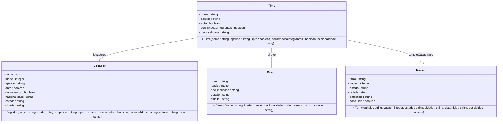

# Projeto api para torneio de Brawhalla

## Diagrama

```mermaid
classDiagram
    class Time {
        - nome : string
        - apelido : string
        - apto : boolean
        - confirmacaoIntegrantes : boolean
        - nacionalidade : string
        + Time(nome : string, apelido : string, apto : boolean, confirmacaoIntegrantes : boolean, nacionalidade : string)
    }
    class Jogador {
        - nome : string
        - idade : integer
        - apelido : string
        - apto : boolean
        - documentos : boolean
        - nacionalidade : string
        - estado : string
        - cidade : string
        + Jogador(nome : string, idade : integer, apelido : string, apto : boolean, documentos : boolean, nacionalidade : string, estado : string, cidade : string)
    }
    class Diretor {
        - nome : string
        - idade : integer
        - nacionalidade : string
        - estado : string
        - cidade : string
        + Diretor(nome : string, idade : integer, nacionalidade : string, estado : string, cidade : string)
    }
    class Torneio {
        - titulo : string
        - vagas : integer
        - estado : string
        - cidade : string
        - dataInicio : string
        - concluido : boolean
        + Torneio(titulo : string, vagas : integer, estado : string, cidade : string, dataInicio : string, concluido : boolean)
    }
    Time "1" -- "*" Jogador : jogadores
    Time "1" -- "1" Diretor : diretor
    Time "1" -- "1" Torneio : torneioCadastrado
```
