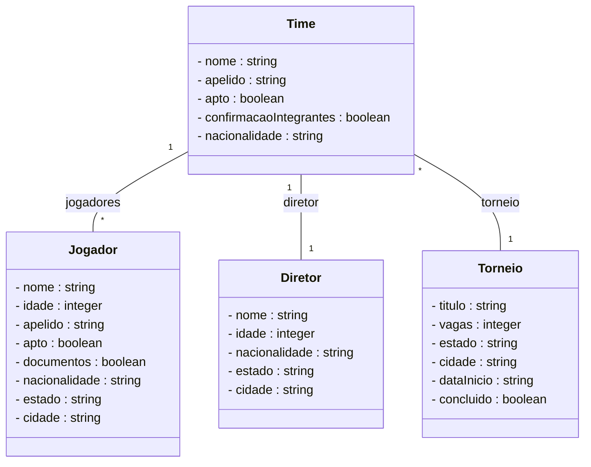

# Projeto api para torneio de Brawhalla

## Requisitos nao funcionais

- Java 21
- Spring Boot 3.4.3
  - JPA
  - Web
  - Actuator
- h2 (para ambiente de dev)
- postgresql
- Spring openapi webmvc ui
- Gerenciador de dependencia -> MAVEN 4.0.0

## Diagrama

