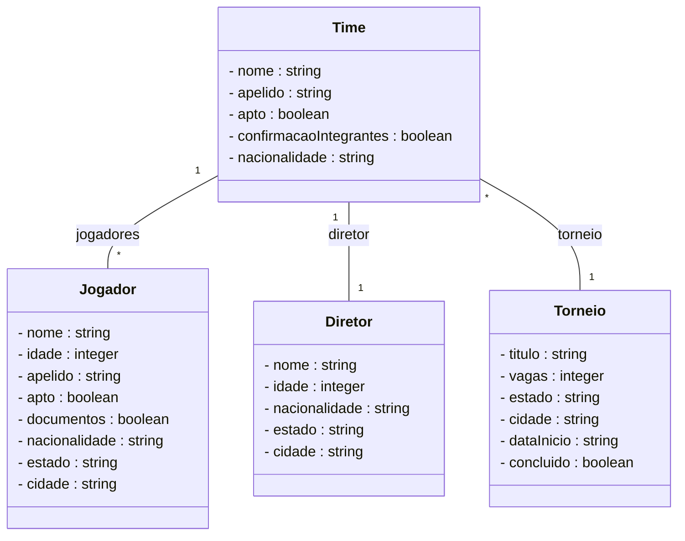

# Projeto api para torneio de Brawhalla

## Requisitos nao funcionais

- Java 21
- Spring Boot 3.4.3
  - JPA
  - Web
  - Actuator
- h2 (para ambiente de dev)
- postgresql
- Spring openapi webmvc ui
- Gerenciador de dependencia -> MAVEN 4.0.0

### Exemplo de cadastro
```json
{
  "nome": "nome Time",
  "apelido": "NT",
  "apto": false,
  "confirmacaoIntegrantes": true,
  "jogadores": [
    {
      "nome": "Jonathan",
      "idade": 20,
      "apelido": "DRX",
      "apto": true,
      "documentos": true,
      "nacionalidade": "brasileiro",
      "estado": "Paraiba",
      "cidade": "Campina Grande"
    },
    {
      "nome": "Douglas",
      "idade": 20,
      "apelido": "Draken",
      "apto": true,
      "documentos": true,
      "nacionalidade": "brasileiro",
      "estado": "Paraiba",
      "cidade": "Campina Grande"
    }
  ],
  "nacionalidade": "brasileira",
  "diretor": {
    "nome": "Joaquim",
    "idade": 35,
    "nacionalidade": "brasileiro",
    "estado": "Paraiba",
    "cidade": "Campina Grande"
  },
  "torneioCadastrado": {
    "titulo": "Brawlhalla Summer Championship Singles 2023 Australia & SEA Brawlhalla , Ubisoft 29.07.23 $5 000",
    "vagas": 15,
    "estado": "Paraiba",
    "cidade": "Joao Pessoa",
    "dataInicio": "2025-06-10T00:00:00",
    "concluido": false
  }
}
```

## Diagrama


